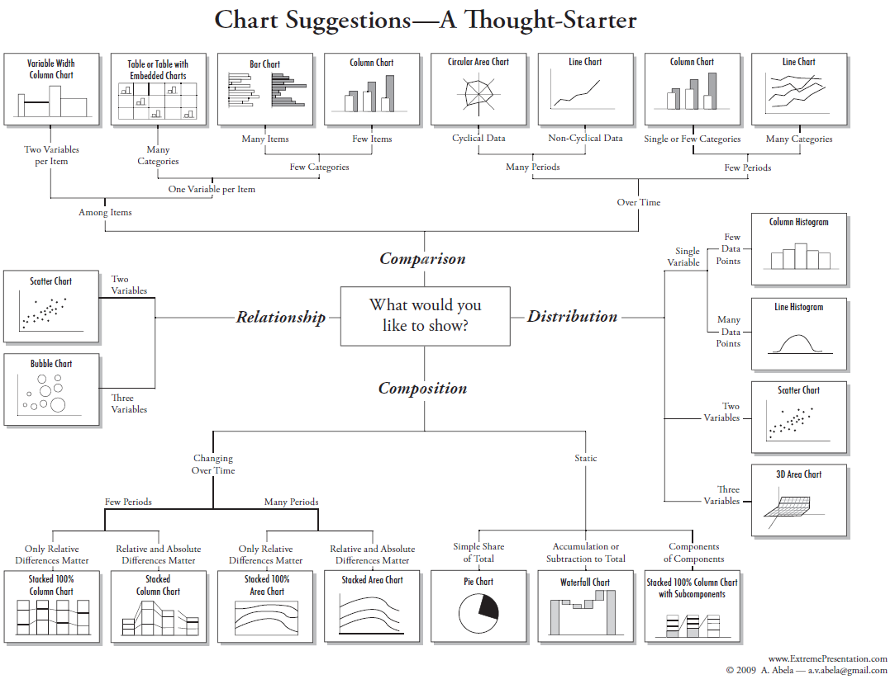

:::::::::::::::::::::::::::::::::::::: questions 

1. What are four common messages usually communicated in a chart?
2. What are useful charts to communicate these messages?
3. How do we construct text to describe these messages?
4. How does the type of data help determine the message?

::::::::::::::::::::::::::::::::::::::::::::::::

::::::::::::::::::::::::::::::::::::: objectives

After completing this episode you will be able to:

- identify data types as discrete, continuous, or categorical
- interpret and describe the message in four common chart types
- illustrate the message of four common chart types 
- use a flow diagram to choose a chart type to communicate your message

::::::::::::::::::::::::::::::::::::::::::::::::

## Introduction

## Data Types  
Charts communicate a message about data that is dependent on the type of data. Data types matter both in terms of what types of statistical analyses, and what types of  visualization techniques are appropriate for the type of data you are working with.

Data scientists differ on the number of different data types, with some describing as many as 14 unique types. For this lesson we will keep the number of data types limited to three: discrete, continuous, and categorical. There can be finer divisions, or different names of data types used in a discipline, but for this lesson we will stick with these three.

Quantitative data involves numbers applied to measurable and quantifiable variables. We will consider two types of quantitative data in this lesson, discrete and continuous.
Discrete data are data that consist of distinct and separate values, Often in whole numbers and used to measure discrete occurrences of a phenomenon. Examples include number of firefighters employed by a city, and number of cars sold at a dealership during a month.
Continuous data can represent a range of values and can be measured by any real numbers within the range, including decimals and fractions. Used to measure phenomena that  occur and change in ways measured precisely over fractions of a unit. Examples include rainfall, height, and temperature.

Categorical data do not represent quantitative information but qualitative data (i.e., information that is not a number, but a descriptive property of the system of interest, such as inclusion in a distinct  category). 
Variables can be categorized without any inherent order or ranking, such as types of fruits (apple, orange, banana). Or the variables may be ordered with a meaningful ranking such as Olympic medals (Gold, Silver, Bronze) but the intervals between categories aren’t expected to be uniform or measurable.  Categorical data is often used for labeling and classification purposes, and statistical operations such as counting and mode are appropriate. 

The distinctions between discrete and continuous data can vary, depending on the level of precision of the measurements being taken. For this lesson, as a general guideline when we look at data and example visualizations, let’s define discrete data as data with measurements in whole numbers, such as counts, and continuous data as data that has measurements in decimal values.
To discuss these data types and later decide what charts to make and how to make them we are going to use a long-term dataset collected on the canids of North America. The data are presented in Newsome and Ripple 2015. The paper has an analysis of fur return data in multiple locations in North America to test whether the presence or absence of wolves caused a shift in coyote and red fox density across the continent. Brief summary of findings are that without wolves in an area, coyotes outnumber red foxes. In areas with wolves, red foxes outnumber coyotes. And there is a transition zone of 200 km on the edge of a wolf distribution area where the effect is weakened.

The data are presented in Newsome and Ripple 2015 . 

:::::::::::::::::::::::::::::::::::::::::::::::::::::::::::::::::::: instructor

Inline instructor notes can help inform instructors of timing challenges
associated with the lessons. They appear in the "Instructor View"

::::::::::::::::::::::::::::::::::::::::::::::::::::::::::::::::::::::::::::::::

::::::::::::::::::::::::::::::::::::: challenge 

## Challenge 1

Choose the answer that most closely reflects your opinion.
Data visualization is for ____.

a) scientists
b) everyone
c) formal reports
d) economists

:::::::::::::::::::::::: solution 

## Output
 
`b) everyone!`

:::::::::::::::::::::::::::::::::

## Challenge 2: Pair the data type names with the examples    

| Data Types  |   Example of data |
| ----------- | ----------- |
| 1. discert   |  a. 1,2,3,...1000 |
| 2. continuous  |  b. 0,1 |
| 3. catagorical  |  c. dog, cat, turtle |

:::::::::::::::::::::::: solution 

1. -> b
2. -> a
3. -> c

:::::::::::::::::::::::::::::::::
::::::::::::::::::::::::::::::::::::::::::::::::

## Turning Data into Charts

We can think of turning data into charts as a process of transforming the data into a visual form. The visual form that we choose will be impacted by the type of data, and what kind of messages we want to be able to see, or to show others with the visualization.

## Four Common Chart Types

Comparison
Composition
Distribution
Relationships

## Identify the message  

What is the message of this graph?  

{On average across North America throughout the collection period foxes made up 80?% and Coyotes made up 20% of the canids}
Write, pair, and share (if possible).

What is the message of this graph?  
{North American fox populations averaged 3765 (units) prior to Jan. 1, 1970 and 2062 after}
Discuss message as a group

What is the message of this graph?  
{Coyote populations in Maine ranged from zero to 2741 throughout the collections period and had a median of 1393 and mean of 1296 units}
Discuss message as a group

What is the message of this graph?  
{NEED BETTER DESCRIPTION}
Discuss message as a group

## Describe the message  

What are the basic components of each of the above's message? So replace the nouns with a noun from your field of study.  Does the message still make sense?   

## Illustrate the message  

In a drawing application of your choice (including pencil and paper), draw a chart that matches the following descriptions.

1. The presence of wolves promoted fox abundance more than coyote abundance in the 1980s.
2. Higher mean annual air temperature decreased the ratio of foxes to coyotes across North America.
3. Overall fox abundance has a log-normal distribution.  
4. The proportion of all canids that are coyote increases from eastern to western locations.

 
## Use a flow chart to choose a chart for your message  

The chart chooser graphic is an informative tool to help you decide what chart types are appropriate for your message and data.

### Optional Exercise  
Find a chart from your field of interest.  It can be from a book, on-line or even hand drawn.  Using the chart chooser to decide what type of message is being conveyed in the chart.  Also, what are the data types presented in the chart?

::::::::::::::::::::::::::::::::::::: keypoints 

- Identifying the data type helps to narrow the choices of available charts for to convey your message.
- Charts convey messages with interchangeable nouns and verbs.
- Comparison, composition, distribution, and relationships are four very common messages in charts.
- Practice with linking chart types with data types is a valuable skill

::::::::::::::::::::::::::::::::::::::::::::::::

[r-markdown]: https://rmarkdown.rstudio.com/
