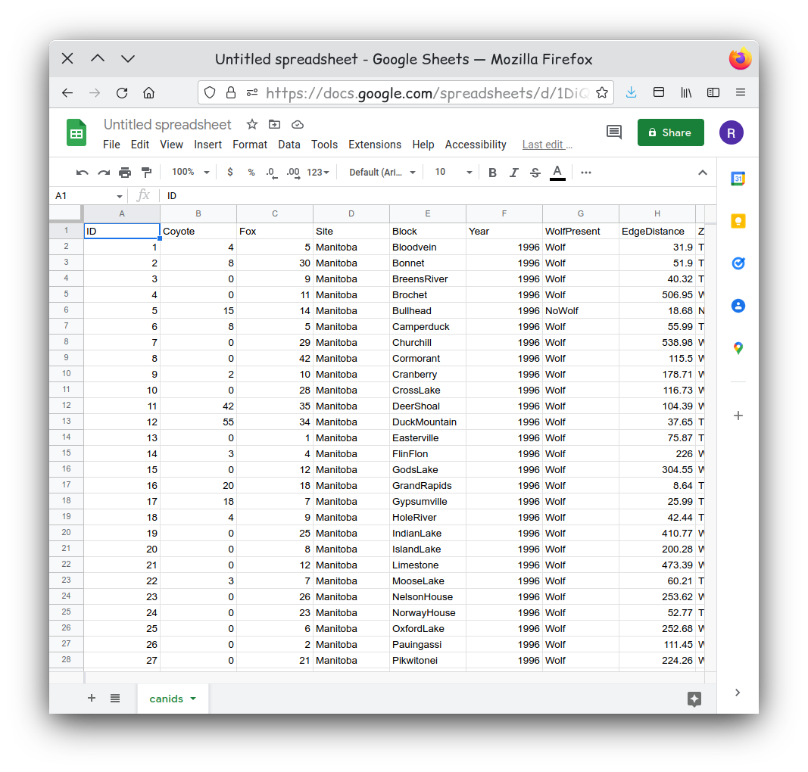
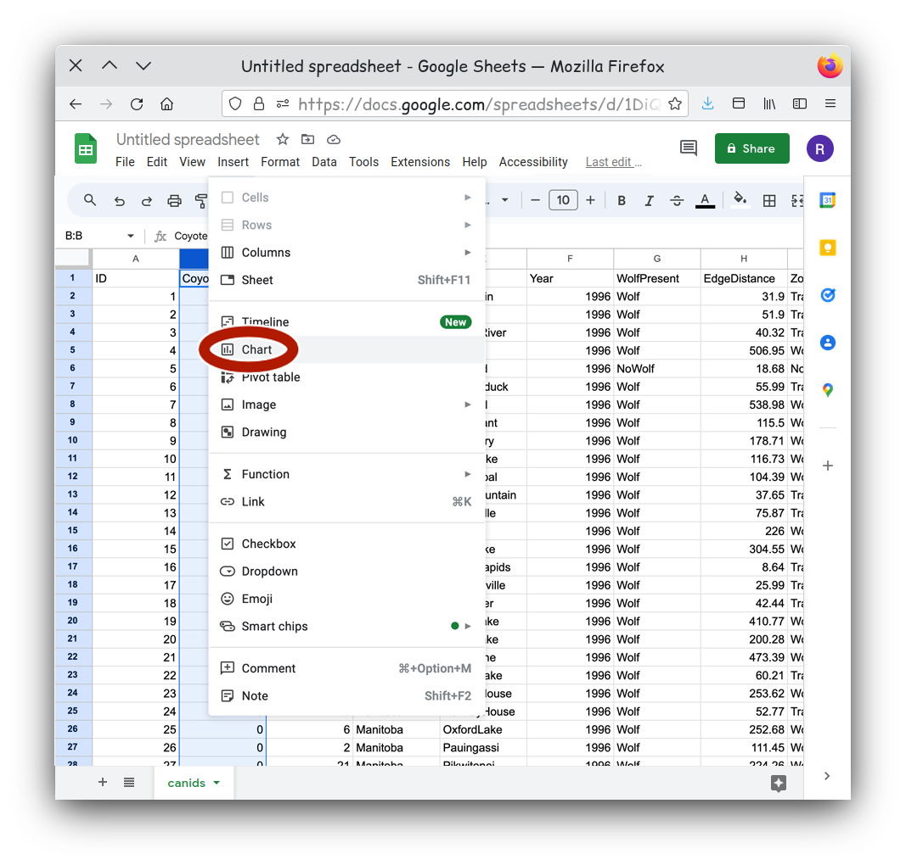
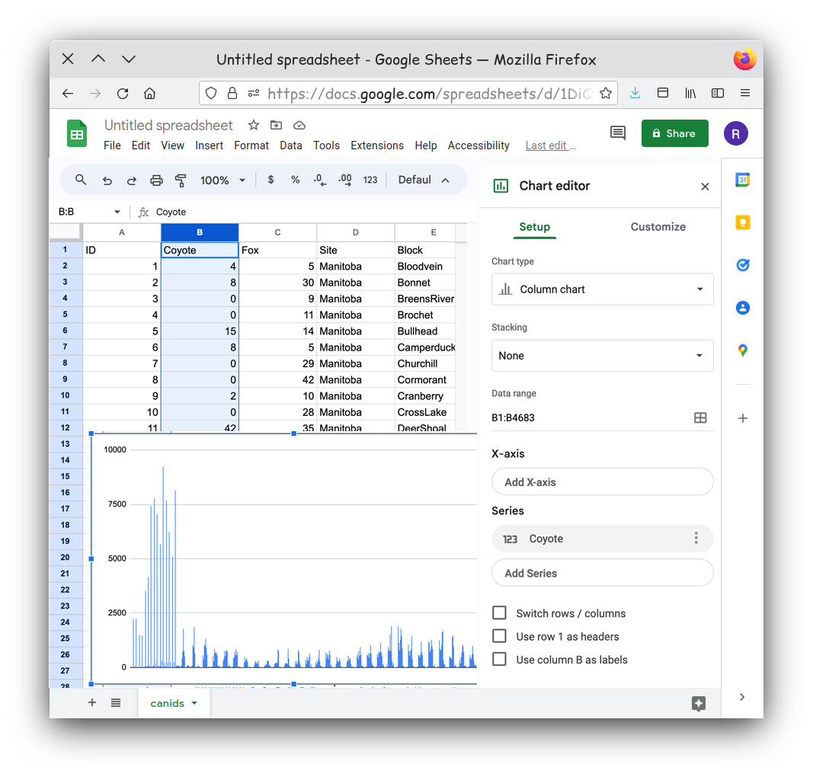
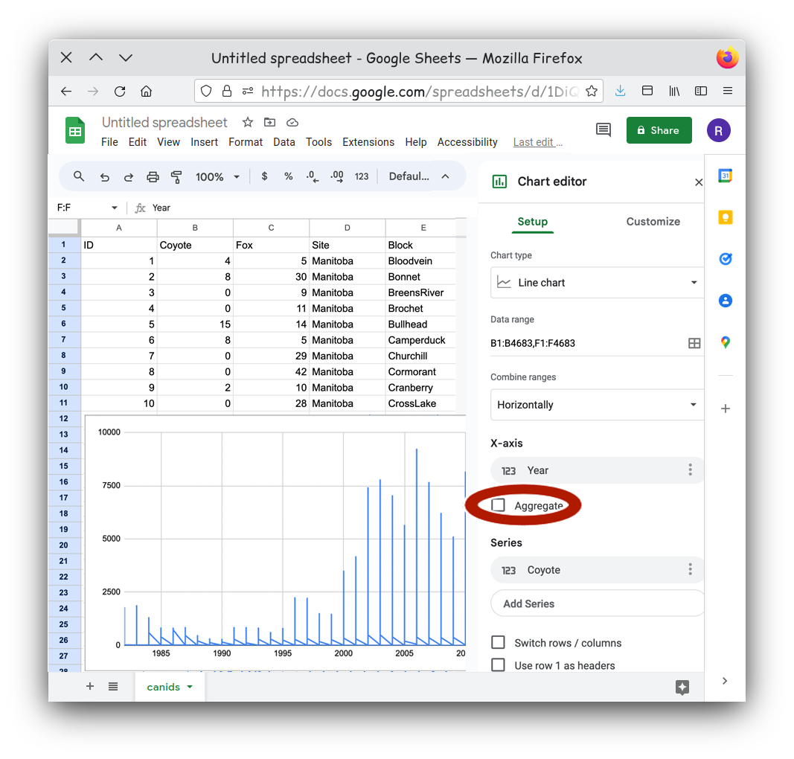
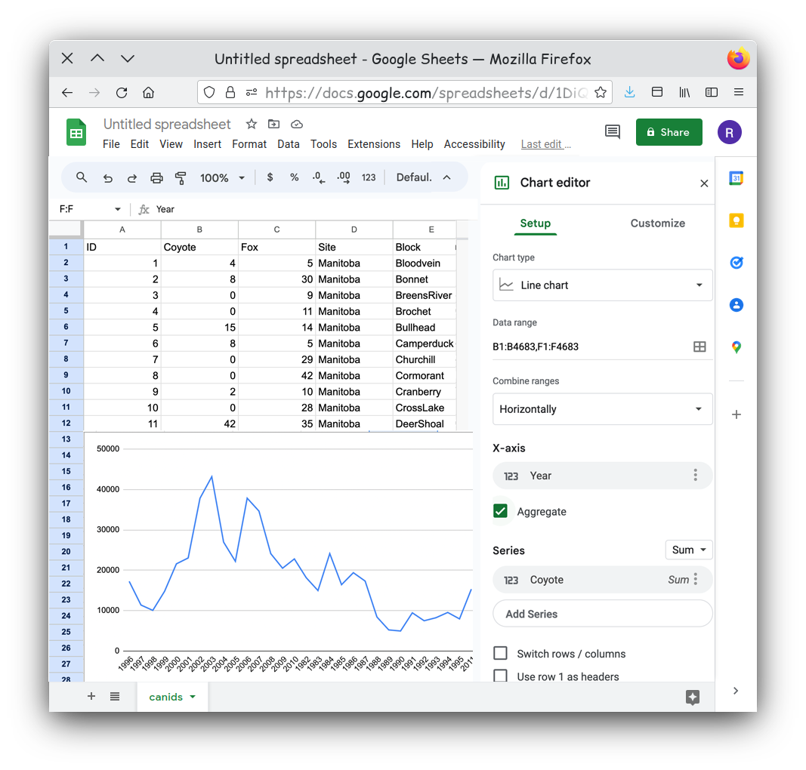
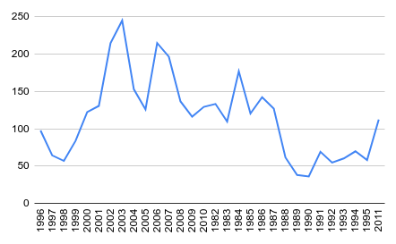

:::::::::::::::::::::::::::::::::::::: questions 

1. What are the important aspects of a dataset you want to communicate?
2. What is the best visualization type for a particular dataset?

::::::::::::::::::::::::::::::::::::::::::::::::

::::::::::::::::::::::::::::::::::::: objectives

- Identify what message would like to communicate about a dataset.
- Identify how to best communicate the message with appropriate visuals.
- Generate graphs based on your decisions using software.

::::::::::::::::::::::::::::::::::::::::::::::::

## Introduction

This chapter will use the knowledge you have gained and apply it to generate graphs using software tools. What you should know:

1. There are a multitude of software tools that can help generate charts for you.
2. All software tools have the strengths and weaknesses. There is no best tool for all tasks or all users.
3. For this lessen we will be using Google Sheets. For our purposes this tool has some important advantages.
    1. The software is freely available online.
    2. The software works similarly regardless of the user's operating system
    3. The software is interacted primarily through a graphical interface that can make it more intuitive to new users.

:::: instructor

Other tools can have many advantages as well. Certain software which use a command line interface may have a steeper learning curve, but has other advantages such as improved reproducibility. 

::::

## Importing your Data
We need to import our canid data into Google Sheets. Our data is currently stored as tab separated values, otherwise known as a tsv file. This is a simple text file. Each line of the file represents a new line in a table. The values in each column of the table appear in sequence separated by a tab character. Generally tsv tables have the limitation that you can't store any values in a table that also has a tab character. If you haven't already, go ahead and download the canid data now. 

[Your Data](data/canids.tsv)

To import this into Google Sheets you first need to go to the [website] (https://docs.google.com/spreadsheets/). It will prompt you to log into a Google account. You will need to use a Google account to use Google Sheets, but if you do not have one, they are free [Google Account Sign-up](https://accounts.google.com/signup/v2/webcreateaccount?biz=false&flowName=GlifWebSignIn&flowEntry=SignUp&hl=en).

While there you will want to create a new blank spreadsheet.

{alt='new google sheet'}

Then navigate to the `File` menu and select `Import`.

{alt='google sheet import'}

Select the `Upload` tab on the new window. Here you can drag and drop you canids.tsv onto the window. You can also click 'Browse' if you prefer to navigate to your file.

{alt='google sheet upload'}

Tab separated files are well supported on Google Sheets, and the default import options should be fine. If your have issues you could try setting the selector type to `Tab`.

{alt='google sheet file type'}

Your data should now be imported and visible in a new sheet.

{alt='google sheet file type'}

:::: challenge 

## Activity 1
Examine your dataset. Does it appear to be clean and tidy?

Remember clean data has no:
- White spaces before or after data in each cell
- Outliers, nulls, missing data, or empty cells
- Formatting, such as color coding, bold, or italicized text

Also, tidy data is organized so that:
- Columns are for variables
- Rows are for observations
- One value per cell

::::

## Lets Make a Chart

For our first chart let's show the relationship of the counts of coyotes over time. We need to pick our first data series. This will become our y-axis data. Let's pick the count of coyotes so we can compare the coyote counts over time. We can start by selecting  Column B in the spreadsheet.

{alt='select Coyote column'}

Our next step is to turn the data we selected into a chart. Using the `Insert` menu, select `Insert Chart`. 

{alt='insert chart type menu'}

The `Insert Chart` command will result in a default chart which might or might not communicate anything useful to us. 

{alt='new chart'}

There are a few steps we need to do to get a chart that better shows our data. With the Chart Editor open, we can select the type of chart we want, such as a line graph. 

{alt='select line chart type'}

We can add  X-axis values. . 

{alt='add X-axis'}

Once the Select data range menu is open, you can click the top of the column named Year in your table to set Year as our data for the X-axis.

{alt='add X-axis data from Years column'}

Something doesn’t look right. Our line chart seems to be jumping back and forth at each year. 

{alt='new graph with X-axis data'}

If you look at the table you will notice that for every year value we have multiple rows. By default the chart is plotting every row as an independent point, so we have multiple points at every year. Is that really what we want to show? It might be better to show some aggregate value for each year. That would mean a simpler chart and a simpler message. Click the `Aggregate` checkbox for the X-axis.

{alt='aggregate X-axis'}

That looks better, but can you see another issue? Look closely.
{alt='new chart type error'}

Our years are not in order! The years are plotted in the order they appeared on our table. One simple way to solve this is to reorder our table. There are a few different tools you can use, but creating a filter for you table has a few advantages. First it automatically sets your first row as headings, this means when you sort your table the headings always stay at the top. Secondly we can order the table on the fly by simply clicking on a heading. To set this up select the entire table first. This can either be done using the keyboard shortcut of `ctrl-a` or by clicking on the upper leftmost square in your table This is the rectange above the row `1` label and to the left of the column `A` label. Next select the `Create a Filter` entry in `Data` menu. 

{alt='new chart type select all'}

You should now see downward facing triangles on each column heading. Click on the icons next to the year column and then select the Select the column year. Now from the `Data` menu select `Sort sheet -> Sort sheet by column F (A-Z)`. 

{alt='new chart type sort'}

Now that our data is sorted our chart should show our data in chronological order.

{alt='new chart type final'}

:::: keypoints 

- Identify if you are communicating a comparison, distribution, composition, relationship.
- Use the chart chooser a good chart for your particular dataset.
- Choose the tool you will be using to generate your chart
- Import your data making sure your data is "clean" and "tidy".
::::
